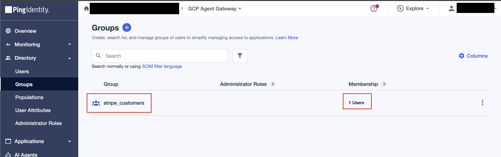
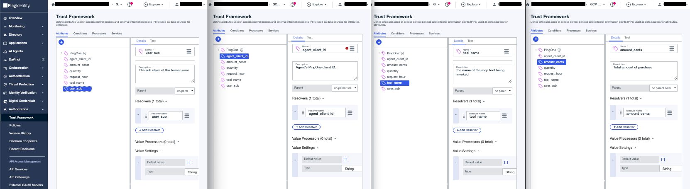
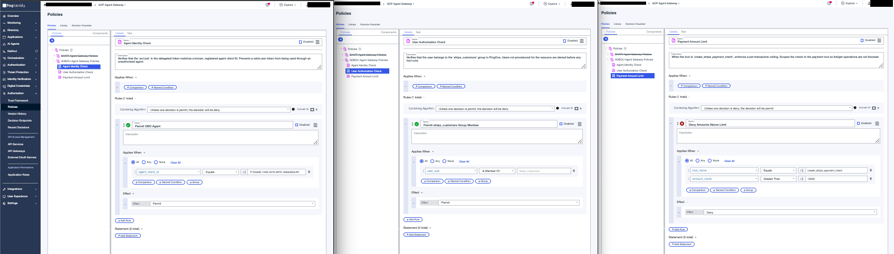
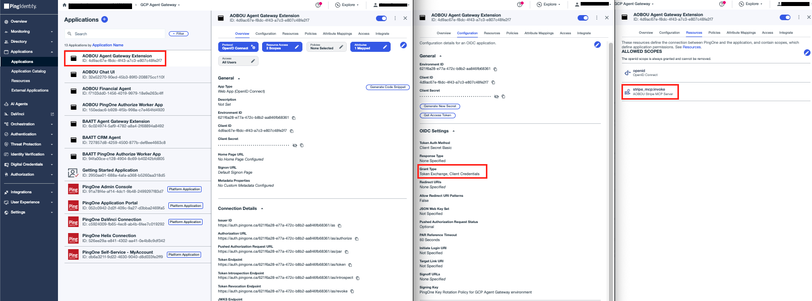

# Agent Gateway Extension Service

An Envoy `ext_proc` gRPC handler that the Agent Gateway calls on every request on the governed path. Deployed on Cloud Run, registered as a Service Extension.

For requests bound to the Stripe MCP tool it:
1. Validates the agent's delegated token: `iss`, `aud`, and `scope`
2. Resolves the user's email from `sub` via the PingOne management API
3. On `tools/call` requests, calls PingOne Authorize with compound attributes; non-`tools/call` requests (initialize, tools/list) skip Authorize
4. On PERMIT, performs an RFC 8693 exchange to produce a tool-audienced token, then injects it as `Authorization: Bearer` and the resolved email as `X-User-Email` before forwarding the request to the Stripe MCP server

## Configure

### 1. Create `stripe_customers` group in PingOne

In **Directory → Groups**, create a group called `stripe_customers` and add any PingOne users who have a matching customer record in Stripe (matched by email).



### 2. PingOne Authorize - Trust Framework

In **Authorization → Trust Framework**, define the request attributes that PingOne Authorize will use to make a decision.
| Attribute | Type | Resolver Parameter |
|---|---|---|
| `user_sub` | String | `user_sub` |
| `agent_client_id` | String | `agent_client_id` |
| `tool_name` | String | `tool_name` |
| `amount_cents` | Number | `amount_cents` |



### 3. PingOne Authorize - Policies

In **Authorization → Policies**, create a Policy Set named `AOBOU Agent Gateway Policies` with combining algorithm **DenyOverrides** (`Unless one decision is deny, the decision will be permit`). Add these 3 child policies:

**Policy 1: Agent Identity Check** — combining: Unless one decision is permit, the decision will be deny
- Rule `Permit OBO Agent` — condition: `agent_client_id` equals your AOBOU agent's PingOne client ID

**Policy 2: User Authorization Check** — combining: Unless one decision is permit, the decision will be deny
- Rule `Permit stripe_customers Group Member` — condition: `user_sub` is a member of the `stripe_customers` group

**Policy 3: Payment Amount Limit** — combining: Unless one decision is deny, the decision will be permit
- Rule `Deny Amounts Above Limit` — condition: `tool_name` equals `create_stripe_payment_intent` AND `amount_cents` is greater than your threshold (e.g. `100000` = $1,000)



### 4. PingOne Authorize - Publish and grab decision endpoint

Go to **Authorization → Version History** and publish the latest version.

Note the decision endpoint URL from **Authorization → Decision Endpoints**.

### 5. PingOne Authorize - Worker App

Create a **Worker** application in PingOne:
- **Name:** AOBOU PingOne Authorize Worker App
- **Grant type:** Client Credentials
- **Roles:** Grant `Environment Admin` and `Identity Data Read Only` scoped to this environment


### 6. PingOne Token Exchange - OIDC Web App

Create an **OIDC Web App application** in PingOne:
- **Name:** AOBOU Agent Gateway Extension
- **Grant Types:** enable both **Client Credentials** and **Token Exchange**
- Assign it the `AOBOU Stripe MCP Server` resource so it may request the `stripe_mcp:invoke` scope



### 7. Configure environment values

```bash
cp .env.sample .env
```

| Variable | Value |
|---|---|
| `GC_REGION` | Deploy region, e.g. `us-central1` |
| `GC_CLOUD_RUN_SERVICE_NAME` | `aobou-agent-gateway-extension-service` |
| `IDP_TOKEN_ENDPOINT` | `https://auth.pingone.<region>/<env-id>/as/token` |
| `IDP_CLIENT_ID` | Token-exchange app Client ID |
| `IDP_CLIENT_SECRET` | Token-exchange app Client Secret |
| `IDP_SCOPE` | Scope the inbound delegated token must carry, e.g. `stripe_mcp:invoke` |
| `IDP_REQUIRED_AUDIENCE` | Expected `aud` on the inbound delegated token, e.g. `stripe-mcp-server` |
| `TOOL_URL` | The Stripe MCP tool's Cloud Run base URL |
| `AUTHZ_DECISION_ENDPOINT` | PingOne Authorize decision endpoint URL |
| `AUTHZ_CLIENT_ID` | Authorize worker app Client ID |
| `AUTHZ_CLIENT_SECRET` | Authorize worker app Client Secret |

## Deploy

```bash
make deploy
```

`deploy` runs `setup`, then `push`, then `gcloud run deploy`.
