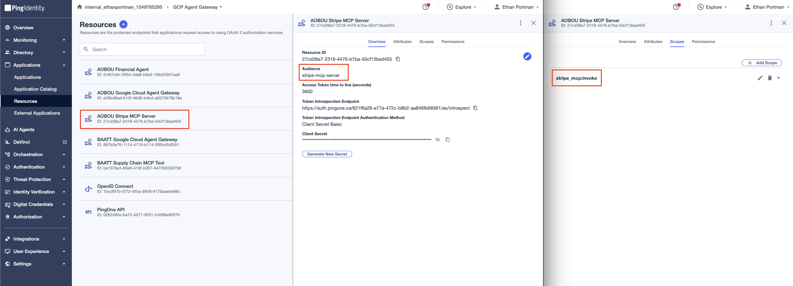
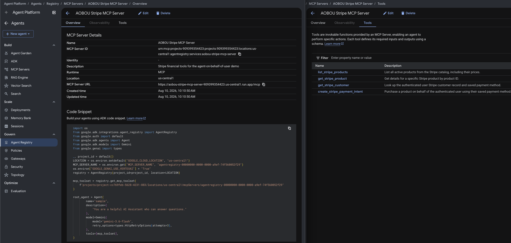

# Stripe MCP Server

An MCP server exposing Stripe tools. Deployed on Cloud Run, registered as an MCP Server in Agent Registry.

On every request it:
1. Validates `iss`, `aud`, `scope`, and `signature` of the inbound token via PingOne JWKS (token injected by Agent Gateway extension service)
2. Reads the caller's email from the `X-User-Email` header (injected by the Agent Gateway extension service)
3. Executes Stripe operations on behalf of that user

## Configure

### 1. Stripe Setup

In the **Stripe Dashboard**, create the products and customers the agent will operate on. Each customer must have a saved payment method attached to their account so that `create_stripe_payment_intent` can charge them without requiring card details at runtime. The customer email in Stripe must match the user's email in PingOne.

### 2. Create the Stripe MCP Server resource in PingOne

In PingOne, create a **Resource** named `AOBOU Stripe MCP Server` with the `stripe_mcp:invoke` scope and `stripe-mcp-server` audience.


### 3. Configure environment values

```bash
cp .env.sample .env
```

| Variable | Value |
|---|---|
| `GC_REGION` | GCP region, e.g. `us-central1` |
| `GC_CLOUD_RUN_SERVICE_NAME` | Cloud Run service name, e.g. `aobou-stripe-mcp-server` |
| `STRIPE_SECRET_KEY` | Stripe secret key (`sk_...`) — stored in Secret Manager as `stripe-secret-key` |
| `IDP_ISSUER` | PingOne issuer URL, e.g. `https://auth.pingone.com/<env-id>/as`. |
| `IDP_REQUIRED_AUDIENCE` | Expected `aud` claim, e.g. `stripe-mcp-server` |
| `IDP_REQUIRED_SCOPE` | Scope the inbound token must carry, e.g. `stripe_mcp:invoke` |

## Deploy

```bash
make deploy
```

`deploy` runs `setup`, then `push`, then `gcloud run deploy`.

## Register

Register the server in the Agent Registry (Agent Platform → Govern → Agent Registry → Add MCP Server):
- **Name:** `aobou-stripe-mcp-server`
- **Description:** Stripe MCP server for the Agent On-Behalf-Of User demo
- **Region:** Same as Cloud Run deployment (e.g. `us-central1`)
- **MCP Server URL:** `<Cloud Run service URL>/mcp`
- **Tool specification JSON:** Paste the contents of `tool-spec.json`


