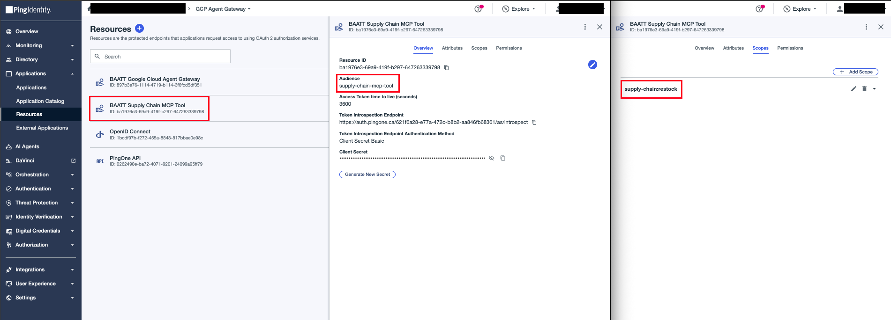

# Supply Chain MCP Tool

An MCP server on Cloud Run exposing a single `restock` tool. This is the resource the agent ultimately calls. The agent will have to go through the agent gateway (and the agent-gateway-extension-service) to get here. This MCP Server also verifies the OAuth token that the gateway injects.

The `restock` handler itself is a mock that returns a hardcoded accepted order — the demo's point is the auth boundary, not the business logic.

## Configure

1. Create the Supply Chain MCP Tool resource  
In PingOne, create a **Resource** named `BAATT Supply Chain MCP Tool` with the `supply-chain:restock` scope and `supply-chain-mcp-tool` audience.


2. Fill in the environment values

```bash
cp .env.sample .env
```

| Variable | Value |
|---|---|
| `GC_REGION` | Deploy region, e.g. `us-central1` |
| `GC_CLOUD_RUN_SERVICE_NAME` | `baatt-supply-chain-mcp-tool` |
| `IDP_ISSUER` | `https://auth.pingone.<region>/<env-id>/as` |
| `IDP_JWKS_URL` | `https://auth.pingone.<region>/<env-id>/as/jwks` |
| `IDP_REQUIRED_AUDIENCE` | `supply-chain-mcp-tool` |
| `IDP_REQUIRED_SCOPE` | `supply-chain:restock` |

## Deploy

```bash
make deploy
```

`deploy` runs `setup`, then `push`, then `gcloud run deploy`.

## Register

Register the server in the Agent Registry (Agent Platform → Govern → Agent Registry → Add MCP Server).
- **Name:** BAATT Supply Chain MCP Tool
- **Description:** Simple Restock tool for BAATT demo
- **Region:** Same as Cloud Run deployment (`us-central-1`)
- **MCP Server URL:** `<URL of Cloud Run MCP Server>/mcp`
- **Tool specification JSON:** Paste the contents of `tool-spec.json`


